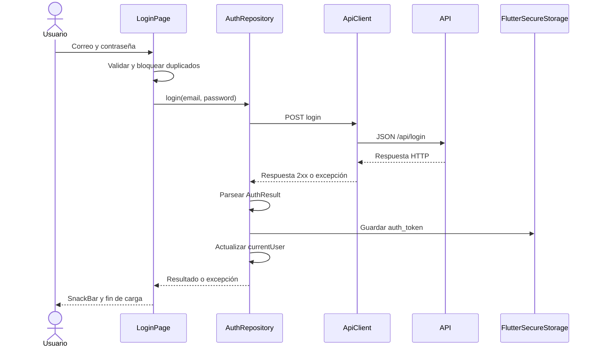

# Documentación técnica de Papatzoa Care Mobile

Revisión: 26 de septiembre de 2026. Este documento describe el código local. El backend se mantiene por separado; el contrato documentado corresponde a modelos y fixtures del repositorio y no fue verificado contra el servicio desplegado.

## 1. Alcance y tecnologías

Cliente móvil de bienestar emocional para pacientes y terapeutas. Actualmente implementa autenticación inicial mediante correo y contraseña.

| Componente | Configuración |
| --- | --- |
| Flutter verificado | 3.47.5 stable |
| Dart verificado | 3.13.4; restricción `^3.13.4` |
| Versión de aplicación | `1.0.0+1` |
| UI | Material 3, tema claro/oscuro según sistema |
| HTTP | `http: ^1.0.0` |
| Almacenamiento | `flutter_secure_storage: ^11.2.0` |
| Validación | `flutter_test`, `flutter_lints: ^6.0.0` |
| Plataformas presentes | Android e iOS |

`pubspec.yaml` declara restricciones y `pubspec.lock` fija versiones resueltas. No hay proyecto web; la configuración usa `dart:io`.

## 2. Arquitectura y estructura

```text
lib/
  main.dart                          Entrada y runApp
  app/app.dart                       MaterialApp
  core/
    config/app_environment.dart      Entorno y URL base
    network/api_client.dart          Transporte HTTP
    network/api_exceptions.dart      Errores de API y red
    routing/app_router.dart          Builders registrados
    routing/app_routes.dart          Constantes de rutas
    theme/app_theme.dart             Paleta y temas
  features/auth/
    data/models/auth_result.dart     Resultado de autenticación
    data/models/auth_user.dart       Usuario
    data/repositories/auth_repository.dart
    presentation/pages/login_page.dart
```

Se separa funcionalidad (`features`) de infraestructura compartida (`core`). La UI usa `StatefulWidget` y `setState`, sin gestor de estado adicional. El repositorio admite inyección de `ApiClient` y `FlutterSecureStorage`; la página admite inyección de repositorio para pruebas.



El usuario se actualiza después de guardar el token. El login exitoso limpia la contraseña y permanece en `/login`. La UI muestra un mensaje fijo de éxito aunque el modelo también recibe un mensaje del servidor.

## 3. Entornos y ejecución

`ENV` se define al compilar mediante `--dart-define`. Solo el valor exacto `production` selecciona producción; cualquier otro valor usa desarrollo. No se carga `.env` ni existe una variable de compilación para sobrescribir la URL.

| Entorno | Destino | URL base |
| --- | --- | --- |
| Desarrollo (predeterminado) | Android | `http://10.0.2.2:8000/api` |
| Desarrollo | Otras plataformas nativas, incluido iOS | `http://127.0.0.1:8000/api` |
| Producción | Android e iOS | `https://papatzoa.onrender.com/api` |

```sh
flutter pub get
flutter devices
flutter run --dart-define=ENV=development
flutter run --dart-define=ENV=production
```

Añadir `-d <id>` para seleccionar un dispositivo. El backend local debe escuchar en el puerto 8000 y ofrecer `/api/login`. Si cambia el puerto, actualizar `AppConfig`. En dispositivos físicos, las direcciones actuales de desarrollo no apuntan al equipo anfitrión: configurar una dirección accesible y verificar las políticas nativas de transporte.

## 4. Cliente HTTP

`ApiClient` normaliza la URL con una barra final para preservar `/api/`. Los consumidores usan rutas relativas, por ejemplo `login`; se rechazan rutas con barra inicial o esquema. Ofrece GET, POST, PUT, PATCH y DELETE.

Todas las solicitudes envían `Accept: application/json`. Si hay cuerpo, se serializa con `jsonEncode` y se añade `Content-Type: application/json`. El timeout de 20 segundos cubre envío y lectura; no hay cancelación explícita de la petición subyacente al vencerlo.

Los códigos fuera de 200–299 generan `ApiException` con código HTTP y mensaje genérico. Socket, `http.ClientException` y timeout se traducen a `NetworkException`. No se expone el cuerpo de error del servidor. El cliente no añade `Authorization`, ni implementa reintentos o renovación de token. `close()` libera el cliente HTTP.

## 5. Contrato de autenticación

Solicitud: `POST /api/login`.

```json
{
  "email": "usuario@example.com",
  "password": "contraseña-de-ejemplo"
}
```

Respuesta de éxito esperada (datos ilustrativos):

```json
{
  "message": "Inicio de sesión correcto.",
  "token": "token-de-ejemplo",
  "user": {
    "id": 32,
    "nombre": "Ricardo",
    "apellido": "Cortez",
    "correo": "usuario@example.com",
    "terapeuta": false,
    "role": "patient"
  }
}
```

El parser requiere `id` entero, `terapeuta` booleano, `user` objeto y los demás campos de tipo cadena. El token debe contener texto no vacío. Un contrato distinto o JSON inválido produce el error genérico del repositorio. `nombre`, `apellido` y `correo` se mapean a `firstName`, `lastName` y `email`.

| Resultado | Comportamiento |
| --- | --- |
| 2xx y contrato válido | Guarda `auth_token`, mantiene usuario y devuelve `AuthResult` |
| 401 | El correo o la contraseña son incorrectos. |
| 422 | Revisa tu correo y contraseña e intenta nuevamente. |
| Otros códigos de error | `ApiException` con código HTTP y mensaje genérico |
| Fallo de red | No pudimos conectar con Papatzoa. Intenta nuevamente. |
| Parseo o escritura fallida | No pudimos iniciar sesión. Intenta nuevamente. |

El token se escribe mediante `FlutterSecureStorage`. La contraseña no se persiste. `currentUser` vive solo en la instancia del repositorio. No hay lectura del token al arrancar, logout, borrado ni revocación de credenciales. Un login fallido no limpia una sesión previamente almacenada.

## 6. Interfaz y rutas

El formulario valida correo requerido con formato básico y contraseña no vacía. Recorta el correo antes de enviarlo; no recorta la contraseña. Permite mostrar/ocultar contraseña, enfocar el segundo campo con Next y enviar con Done.

Durante el envío muestra progreso y deshabilita el botón; una bandera bloquea solicitudes repetidas. Los mensajes usan `SnackBar`. `SafeArea` y `SingleChildScrollView` permiten desplazar el formulario con teclado abierto. Controladores y foco se liberan en `dispose`; la página cierra el repositorio solo si lo creó. Quien lo inyecta debe gestionar su cierre.

`AppRouter` registra únicamente `/login`. `AppRoutes` declara rutas futuras de paciente (`/patient`, citas, diario, red de apoyo y cuenta) y terapeuta (`/therapist`, citas, pacientes y cuenta), sin builders ni pantallas. No hay navegación tras login, redirección por rol ni guards. Registro y recuperación de contraseña tienen botones deshabilitados.

## 7. Configuración nativa y compilación

### iOS

Bundle ID: `com.papatzoa.papatzoaMobile`. Deployment target: iOS 15.0. `Runner.entitlements` declara `keychain-access-groups` con un arreglo vacío y se referencia mediante `CODE_SIGN_ENTITLEMENTS` en Debug, Profile y Release. Verificar firma, equipo de desarrollo y acceso real a Keychain al preparar dispositivos y distribución.

```sh
flutter build ios --simulator --debug --dart-define=ENV=development
flutter build ios --release --dart-define=ENV=production
```

Requiere macOS y Xcode; distribución requiere firma configurada. `Info.plist` no declara excepciones de App Transport Security para HTTP local. Verificar la conectividad en el destino concreto.

### Android

Application ID y namespace: `com.papatzoa.papatzoa_mobile`. Java y objetivo Kotlin: 17. compileSdk, minSdk, targetSdk y NDK se delegan a Flutter.

```sh
flutter build apk --debug --dart-define=ENV=development
flutter build appbundle --release --dart-define=ENV=production
```

Release utiliza actualmente firma debug. El permiso `INTERNET` está en los manifests debug/profile, pero falta en el principal. No hay una política explícita de tráfico HTTP en claro. Antes de distribuir, configurar firma release, permiso de red principal y verificar transporte de cada variante. Estos comandos describen el proceso; no certifican una compilación release validada.

## 8. Pruebas y verificación

```sh
flutter analyze
flutter test
git diff --check
```

Validación del 26 de septiembre de 2026: análisis sin incidencias y 14 pruebas aprobadas.

| Archivo | Cobertura |
| --- | --- |
| `test/api_client_test.dart` | URL por configuración, preservación de `/api`, URL inyectada, rechazo de barra inicial y mensajes de excepción |
| `test/auth_repository_test.dart` | Contrato, POST y cuerpo, almacenamiento de token, usuario en memoria, errores 401/422/500 y fallo de red |
| `test/widget_test.dart` | Arranque, validación, éxito sin navegación, carga, bloqueo de duplicados, teclado y viewport reducido |
| `test/auth_test_support.dart` | Fixtures con HTTP y almacenamiento simulados |

Las pruebas no llaman al backend real ni ejercitan almacenamiento nativo. No certifican conectividad física, timeout real, publicación en tiendas o restauración de sesión. El token de fixture `test-only-token` es ficticio.

## 9. Mantenimiento y pendientes

Añadir módulos en `features`, reutilizar transporte y errores compartidos, registrar builders de rutas y comprobar contratos con pruebas cuando corresponda. Mantener configuración en `AppConfig`, dependencias en `pubspec.yaml` y lockfile versionado.

Pendientes funcionales: paneles por rol, navegación tras login, restauración y cierre de sesión, token en llamadas protegidas, registro y recuperación de contraseña. Pendientes de distribución: firma Android release, permiso de red release, revisión de transporte local y pruebas nativas de almacenamiento seguro.

`.gitignore` excluye `build`, `.dart_tool`, cachés y archivos locales del IDE. No versionar credenciales reales, tokens ni claves de firma. Actualizar este documento cuando cambien contratos, rutas o configuración.
